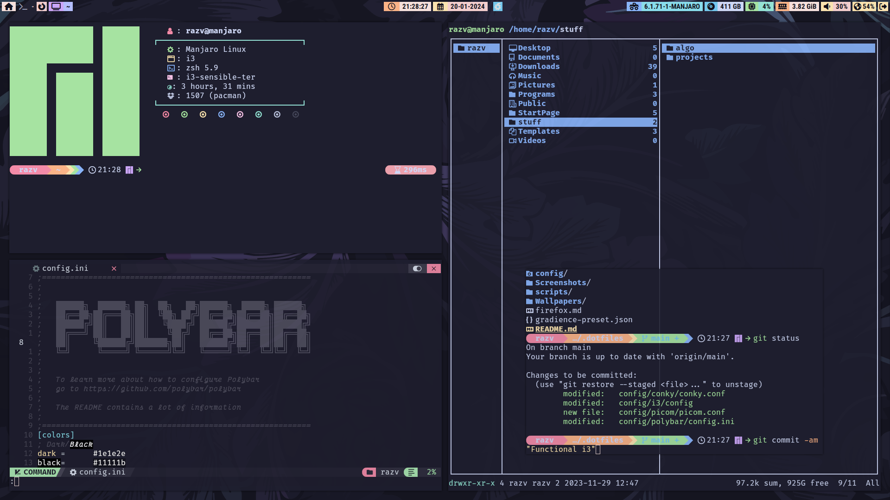
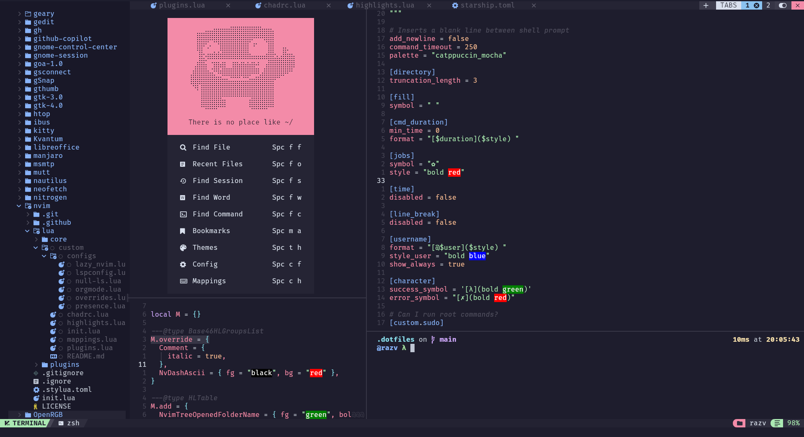

# Dotfiles
## Info:
* **OS:** Manjaro Linux
* **DE/WM:**
  

  
<b>I3</b>

  
  * <b>Bar:</b> Polybar (recolored and tweaked config from [BIBJAW](https://github.com/BIBJAW/Final_Rice))
  * <b>Compositor:</b> Picom
  
  ### Photos:
    

  

  

  
<b>Gnome</b>

  
  ### **Theme**: 
  * Shell: Catppuccin-Mocha-Lavender-dark
  * Legacy: (generated with Gradience) Catppuccin Mocha + RosePine titlebar buttons
  * <b>All Extensions</b>:
    * ~~Alyur's Widgets~~ (deprecated in gnome 45, still looking for replacement)
    * Arc-menu
    * Blur my Shell
    * Compiz window effect
    * Compiz magic lamp effect
    * Dekstop Cube (kinda buggy lately)
    * Just Perfection
    * Pop Shell
    * ~~Space Bar~~ (new workspace indicator is fine for me)
    * ~~Top Bar Organizer~~ Order Gnome Shell Extensions (organizer broke some stuff for me)
    * ~~Unite~~ (breakes workspace indicator in gnome 45. Still looking for replacement.)
    * Vitals
    * Burn my Windows
    * **(Built-In)**:
      * AppIndicator and KStatusNotifierItem Support
      * Gnome 4x UI Imporovements
      * Launch new instance
      * Pamac Updates Indicator
      * Screenshot Window Sizer
      * User Themes
      * X11 Gestures
  * ### Photos:
    
    
    
    

 
  * **Terminal**: kitty
  * **Shell**: zsh
  * **Editor**: nvim with neovide for gui (config based on [Nvchad](https://github.com/NvChad/NvChad) and [Vimacs](https://github.com/UTFeight/vimacs))
  * **Font**: FiraCode Nerd Font Mono + JetBrains (for italic text)
  * **Discord**: betterdiscord (catppuccin mocha css)
  * **Browser**: Firefox with [Cascade](https://github.com/andreasgrafen/cascade) (Catppuccin Lavander theme) + [Chevron](https://github.com/kholmogorov27/chevron) as startpage. Guide for configuration and cascade css in the repo. ☝️
  * **CATPPUCCIN EVERYTHING!!!**
