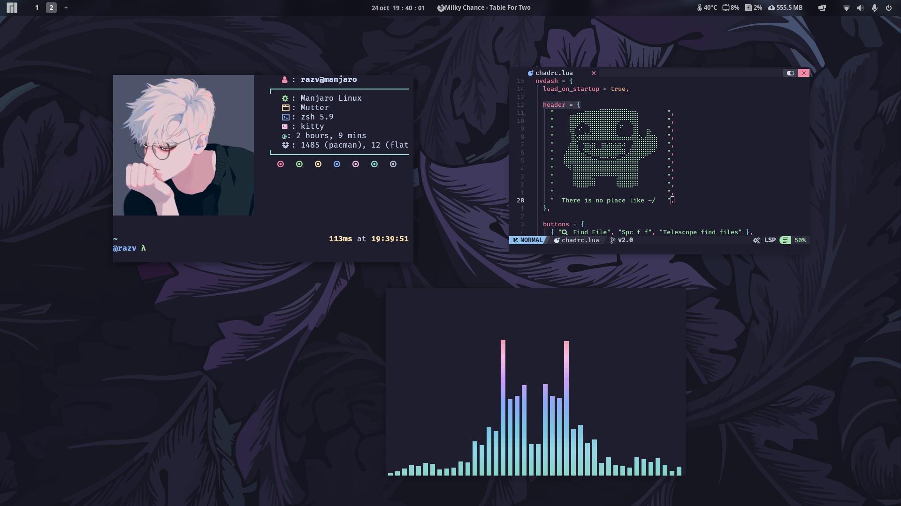
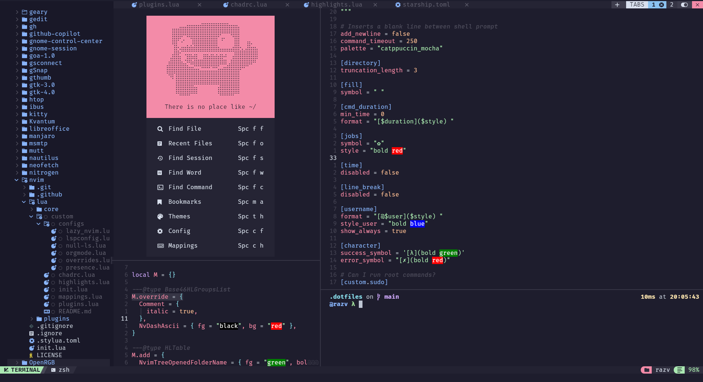
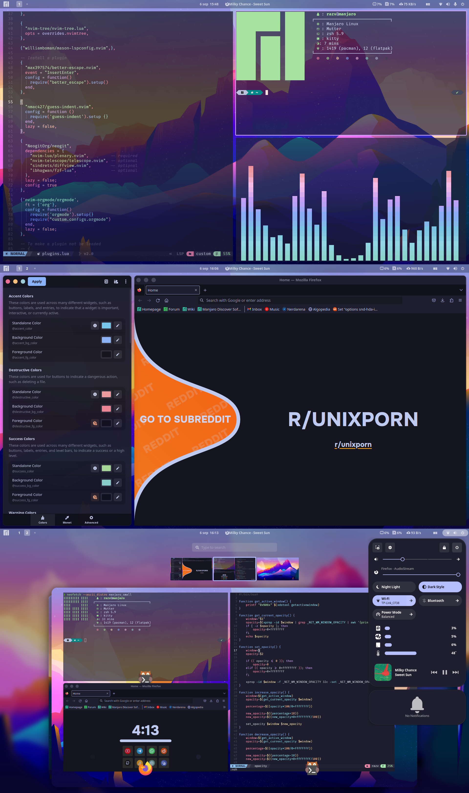

# Dotfiles
## Info:
* **DE**: gnome
* **Theme**: 
  * Shell: Catppuccin-Mocha-Lavander-dark
  * Legacy: (generated with Gradience) Catppuccin Mocha + RosePine titlebar buttons
* **All Extensions**:
  * Alyur's Widgets
  * Blur my Shell
  * Compiz window effect
  * Compiz magic lamp effect
  * Dekstop Cube (kinda buggy lately)
  * Just Perfection
  * Logo Menu
  * Pop Shell (kinda buggy lately)
  * Space Bar
  * Top Bar Organizer
  * Unite
  * Vitals
  * Burn my Windows
  * **(Built-In)**:
    * AppIndicator and KStatusNotifierItem Support
    * Gnome 4x UI Imporovements
    * Launch new instance
    * ~~Native Window Placement~~ (jitter in overview)
    * Pamac Updates Indicator
    * Screenshot Window Sizer
    * User Themes
    * X11 Gestures
* **Terminal**: kitty
* **Shell**: zsh
* **Editor**: nvim with neovide for gui (config based on [nvchad](https://github.com/NvChad/NvChad) and [vimacs](https://github.com/UTFeight/vimacs))
* **Font**: FiraCode Nerd Font Mono + JetBrains (for italic text)
* **Discord**: betterdiscord (catppuccin mocha css)
* **Browser**: Firefox (Catppuccin Lavander theme) + [Chevron](https://github.com/kholmogorov27/chevron) as startpage. Guide for configuration in the repo. ☝️
* **CATPPUCCIN EVERYTHING!!!**
### Photos:

