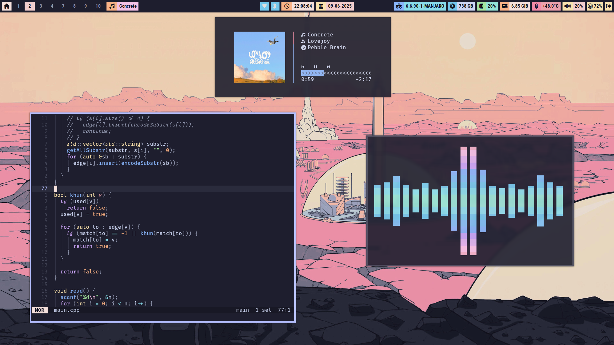
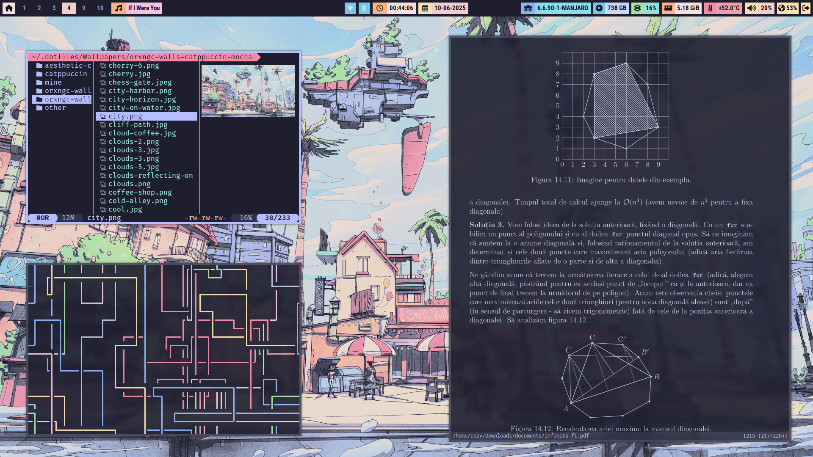
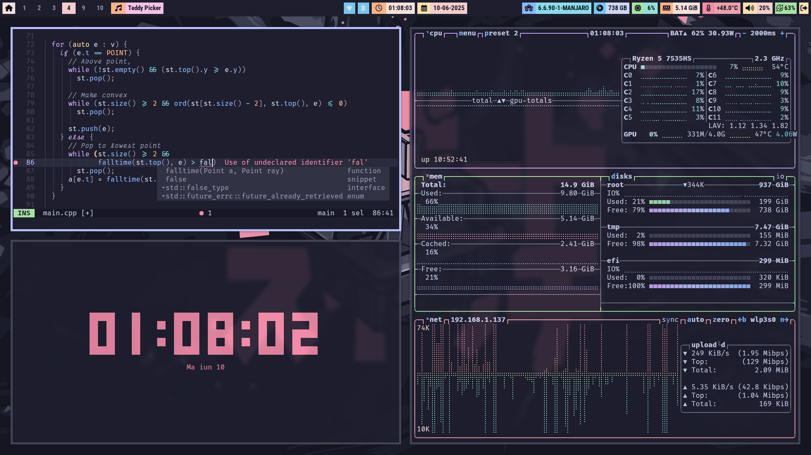
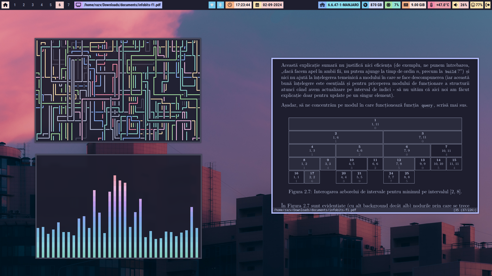
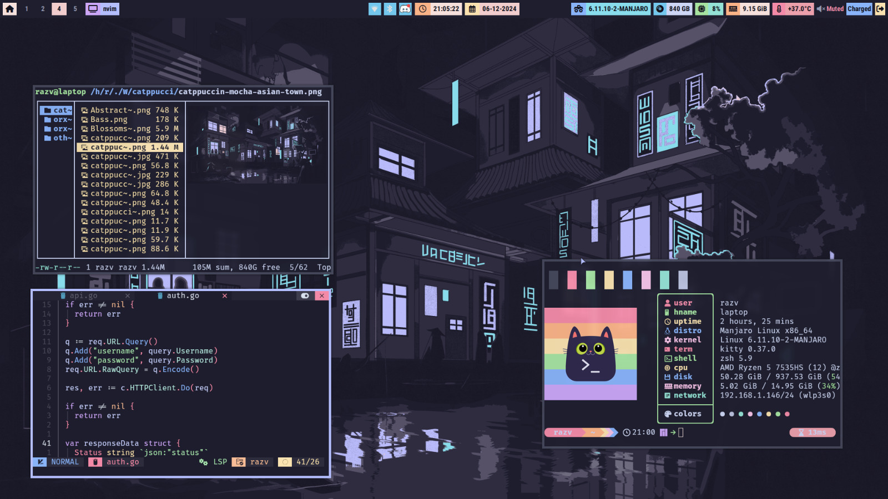
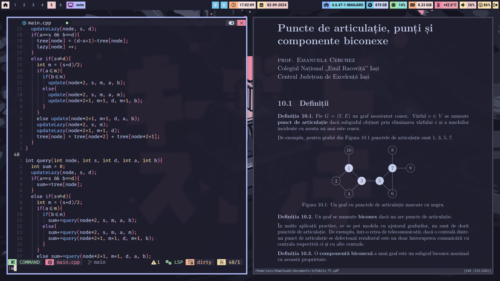
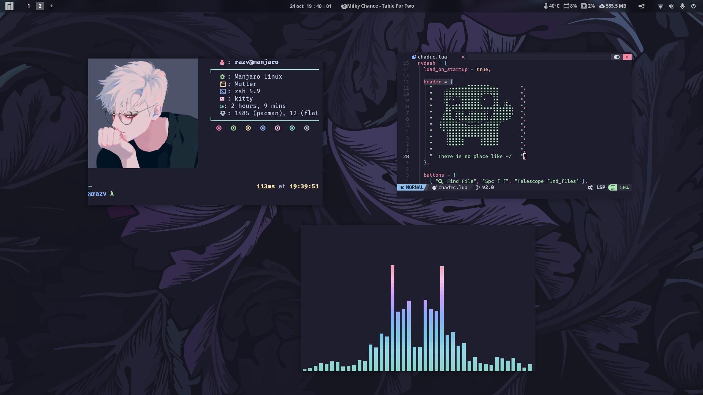
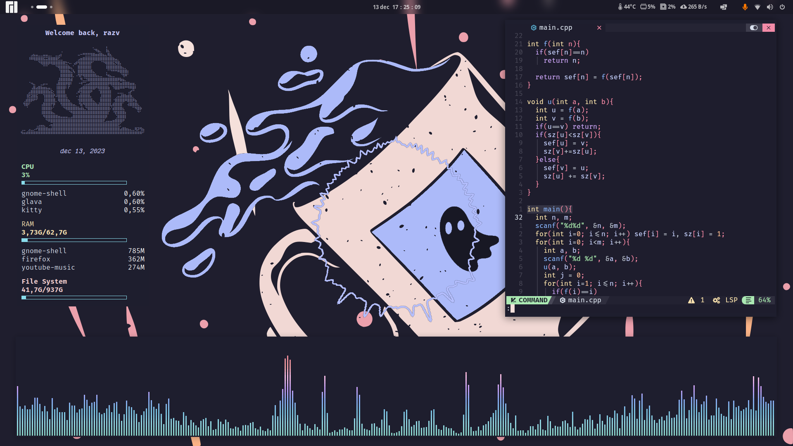

# Dotfiles

## Info:

- **OS:** Manjaro Linux
- **DE/WM:** (click to expand)
  

  
<b>I3</b>

  - <b>Bar:</b> [Polybar](https://github.com/polybar/polybar) (recolored and
    tweaked config from [BIBJAW](https://github.com/BIBJAW/Final_Rice))
  - <b>Compositor:</b> [Picom](https://github.com/yshui/picom)
  - <b>Launcher:</b> [Rofi](https://github.com/davatorium/rofi)

  ### Photos

  
  
  
  <!--  -->
  <!--   -->
  #### More photos in [screenshots](Screenshots/)

  

  

  
<b>Gnome</b>

  ### **Theme**:

  - Shell:
    [Catppuccin-Mocha-Lavender-dark](https://aur.archlinux.org/packages/catppuccin-gtk-theme-mocha)
  - Legacy: (generated with Gradience) Catppuccin Mocha + RosePine titlebar
    buttons
  - <b>All Extensions</b>:
    - ~~[Alyur's Widgets](https://extensions.gnome.org/extension/5338/aylurs-widgets/)~~
      (deprecated in gnome 45, still looking for replacement)
    - [Arc-menu](https://extensions.gnome.org/extension/3628/arcmenu/)
    - [Blur my Shell](https://extensions.gnome.org/extension/3193/blur-my-shell/)
    - [Compiz window effect](https://extensions.gnome.org/extension/3210/compiz-windows-effect/)
      

settings

      - friction: 4.0
      - spring 10.0
      - speedup factor 22.0
      - mass 80
      - x tiles 8
      - y tiles 8
      - maximize effect false
      - resize effect true
      

    - [Compiz magic lamp effect](https://extensions.gnome.org/extension/3740/compiz-alike-magic-lamp-effect/)
    - [Dekstop Cube](https://extensions.gnome.org/extension/4648/desktop-cube/)
    - [Just Perfection](https://extensions.gnome.org/extension/3843/just-perfection/)
    - [Pop Shell](https://aur.archlinux.org/packages/gnome-shell-extension-pop-shell)
    - ~~[Space Bar](https://extensions.gnome.org/extension/5090/space-bar/)~~
      (new workspace indicator is fine for me)
    - ~~[Top Bar Organizer](https://extensions.gnome.org/extension/4356/top-bar-organizer/)~~
      [Order Gnome Shell Extensions](https://extensions.gnome.org/extension/2114/order-gnome-shell-extensions/)
      (organizer broke some stuff for me)
    - ~~[Unite](https://extensions.gnome.org/extension/1287/unite/)~~ (breakes
      workspace indicator in gnome 45. Still looking for replacement.)
    - [Vitals](https://extensions.gnome.org/extension/1460/vitals/)
    - [Burn my Windows](https://extensions.gnome.org/extension/4679/burn-my-windows/)
    - [Media Controls](https://extensions.gnome.org/extension/4470/media-controls/)
    - [Caffeine](https://extensions.gnome.org/extension/517/caffeine/)
    - **(Built-In)**:
      - [AppIndicator and KStatusNotifierItem Support](https://extensions.gnome.org/extension/615/appindicator-support/)
      - [Gnome 4x UI Imporovements](https://extensions.gnome.org/extension/4158/gnome-40-ui-improvements/)
      - [Launch new instance](https://extensions.gnome.org/extension/600/launch-new-instance/)
      - Pamac Updates Indicator (gets installed with pamac i think)
      - [Screenshot Window Sizer](https://extensions.gnome.org/extension/881/screenshot-window-sizer/)
      - [User Themes](https://extensions.gnome.org/extension/19/user-themes/)
      - [X11 Gestures](https://extensions.gnome.org/extension/4033/x11-gestures/)
  - ### Photos:
     
    

- A ton of wallpapers ~~stolen~~ from all over the internet.
- **Terminal**: [kitty](https://github.com/kovidgoyal/kitty)
- **Shell**: zsh
- **Editor**: nvim with [neovide](https://github.com/neovide/neovide) for gui
  (config based on [Nvchad](https://github.com/NvChad/NvChad) and
  [Vimacs](https://github.com/UTFeight/vimacs))
- **Font**: FiraCode Nerd Font Mono + JetBrains (for italic text)
- **Music app:** Youtube Music [yt-ch](https://github.com/th-ch/youtube-music) and [fum](https://github.com/qxb3/fum) as mpris controller
- Social:

  - **Discord**: [betterdiscord](https://betterdiscord.app/) (catppuccin mocha
    css)
  - **WhatsApp**: [nchat - tui client](https://github.com/d99kris/nchat)
  - **Mastodon**: [toot](https://github.com/ihabunek/toot)
  - **Mail**: [neomutt](https://github.com/neomutt/neomutt) (Config inspired
    from: [mutt_dotfiles](https://github.com/ceuk/mutt_dotfiles) and
    [neomutt-powerline-fonts](https://github.com/sheoak/neomutt-powerline-nerdfonts))

- **Browser**: Firefox with [Cascade](https://github.com/andreasgrafen/cascade)
  (Catppuccin Lavander theme) +
  [Chevron](https://github.com/kholmogorov27/chevron) as startpage.
  [Guide](firefox.md) for configuration and cascade css in the repo. ☝️
- **Visualizer:** [Cava](https://github.com/karlstav/cava)
- **PDF Viewer:** [Zathura](https://github.com/pwmt/zathura)
- **CATPPUCCIN EVERYTHING!!!**
